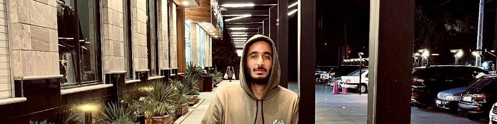

# Hi there, I'm Alireza Shirzadi! 

Welcome to my GitHub profile! I'm a passionate **Frontend Developer** from Kashan, Iran, with a Master's degree in Computer Engineering and nearly 3 years of hands-on experience in designing and building intuitive and scalable web applications. 

---

## 🚀 About Me

- 🌟 **Current Role:** Frontend Engineer at Novin System Company, contributing to innovative products like LIMS, Novin Estate, and Novin Payment.
- 🎓 **Education:** Bachelor's degree in Computer Engineering from Kashan University.
- 🧑‍🏫 **Experience:** Former Compiler Design Teaching Assistant at Kashan University.
- 🌟 **Soft Skills:** Self-confidence, teamwork, humor, and a passionate approach to every project.
- 🖥️ **Portfolio Highlights:**
  - Developed a Real Estate Management App (Novin Estate) using **Next.js**.
  - Built an Online Class Management Platform (LIMS Class).
  - Built an Online Quiz Application (Novin Quiz).
  - Created approximately 10 responsive websites for diverse clients.

---

## 🌐 Connect with Me

---

## 💻 My Technical Skills

---

## 📧 Contact Me

- **Email:** [shirzadiwork@gmail.com](mailto:shirzadiwork@gmail.com)
- **Phone:** (+98) 9399467636

---

> "Code is like humor. When you have to explain it, it’s bad." 

Thanks for stopping by! Feel free to explore my repositories and connect with me.
